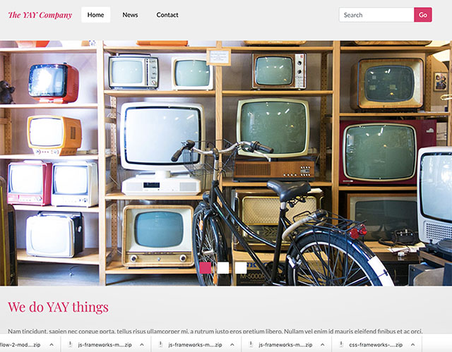

# Yay Company design with React-Bootstrap & Styled Components



## Description

**CSS Frameworks Course Assignment**
From the supplied design, use React Bootstrap, Styled Components to create a responsive website.

## Built With

-   [React-Bootstrap](https://react-bootstrap.github.io/)
-   [Styled Components](https://styled-components.com/)
-   [Google Font](https://fonts.google.com/)

## Getting Started

### Installing

1. Clone the repo:

```bash
git clone https://github.com/nunsinee/css-frameworks-ca-nv.git
```

2. Install the dependencies:

```
npm install or yarn
```

### Running

To run the app, run the following commands:

```bash
npm run start or yarn start
```

### Live web

[https://css-frameworks-ca-nv.vercel.app/](https://css-frameworks-ca-nv.vercel.app/)
